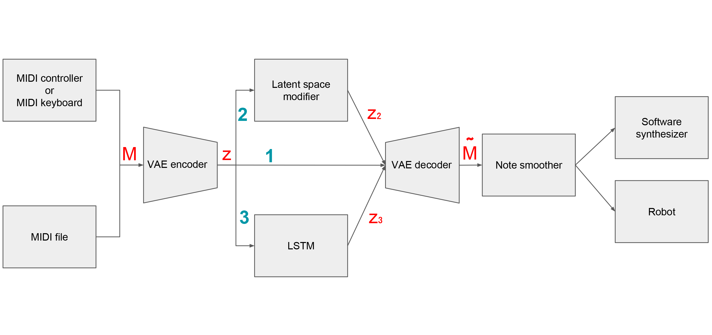

# Robots in Musical Improvisation
Robots in Musical Improvisation: Learning Algorithms Respecting Motion Constrains <br>

Master's Thesis in Robotics, Cognition, Intelligence - Technical University of Munich (TUM)

## Abstract
Humanoid robots have been exposed to increasingly challenging tasks since they steadily grow in resemblance to humans particularly in their skill to intelligently and socially interact with their environment. Recent developments in machine learning and control of musculoskeletal systems allow humanoid robots to perform creative tasks, e.g., drawing
or playing instruments. For humans, it takes years of practice to develop creative skills in arts or music. Musical improvisation, the act of creating a spontaneous response to a currently presented musical sequence, demands high proficiency in an instrument. How would a humanoid robot learn to elaborately improvise on an instrument?


This work proposes an end-to-end framework for robotic improvisation with focus on machine learning algorithms in interaction with the control of a musculoskeletal robot. In spite of sophisticated sampling methods, variational autoencoders were chosen to be the basis for musical improvisation. A new framework that eases the control of musculoskeletal robots was applied to play musical sequences on the marimba.

## System Design


The systems input sequence is played with [W-101 MIDI controller](https://github.com/Roboy/tss18-robotsinmusicalimprovisation/tree/master/midi_controller) or any MIDI keyboard. The sequence is then parsed to matrix M which serves as the input to the encoder of the variational autoencoder (VAE).
Next it can either be
1. reconstructed (Path 1) --> No changes in latent space
2. modified (Path 2) --> Latent space modifier [GUI](https://github.com/Roboy/tss18-robotsinmusicalimprovisation/tree/master/gui)
3. processed by an LSTM network --> [LSTM](https://github.com/Roboy/tss18-robotsinmusicalimprovisation/tree/master/LSTM)

Irrespective of the path, ! get decoded by the VAE decoder. After that, the new sequence $\tilde{M}$ can be smoothed by a Note smoother and then sent to the robot or to a software synthesizer.


## Examples on YouTube
[Variational Autoencoder with Latent space modifier (GUI) "Interact Mode"](https://youtu.be/Umlmhky1DVg)

[Variational Autoencoder with Latent space modifier (GUI) "Endless Mode"](https://youtu.be/gBg1Qecc4QY)

[VAE with Robot (Roboy)] - Video coming soon!

## Simulation
To setup simulation please visit [Roboy Control](https://github.com/Roboy/roboy_control/tree/xyl_simulation)

# Installation
## Prerequisites
1. Create virtual environment one above the root folder of this project and activate it:
```bash
virtualenv ../.rimi -p python3 --no-site-packages
source ../.rimi/bin/activate
```
2. Set PYTHONPATH to the root directory of this project or add to ~/.bashrc
```bash
export PYTHONPATH=$PYTHONPATH:/path/to/dir
```
3. OPTIONAL (for Ubuntu): You will need these for python-rtmidi:
```bash
sudo apt-get install libasound-dev
sudo apt-get install libjack-dev
```

4. Pip install all packages
```bash
pip3 install -r requirements.txt
```
5. Install PyTorch

If you are working on Ubuntu with CUDA 9.0, try:
```bash
pip3 install torch torchvision
```
For other systems or CUDA versions, please visit https://pytorch.org/
